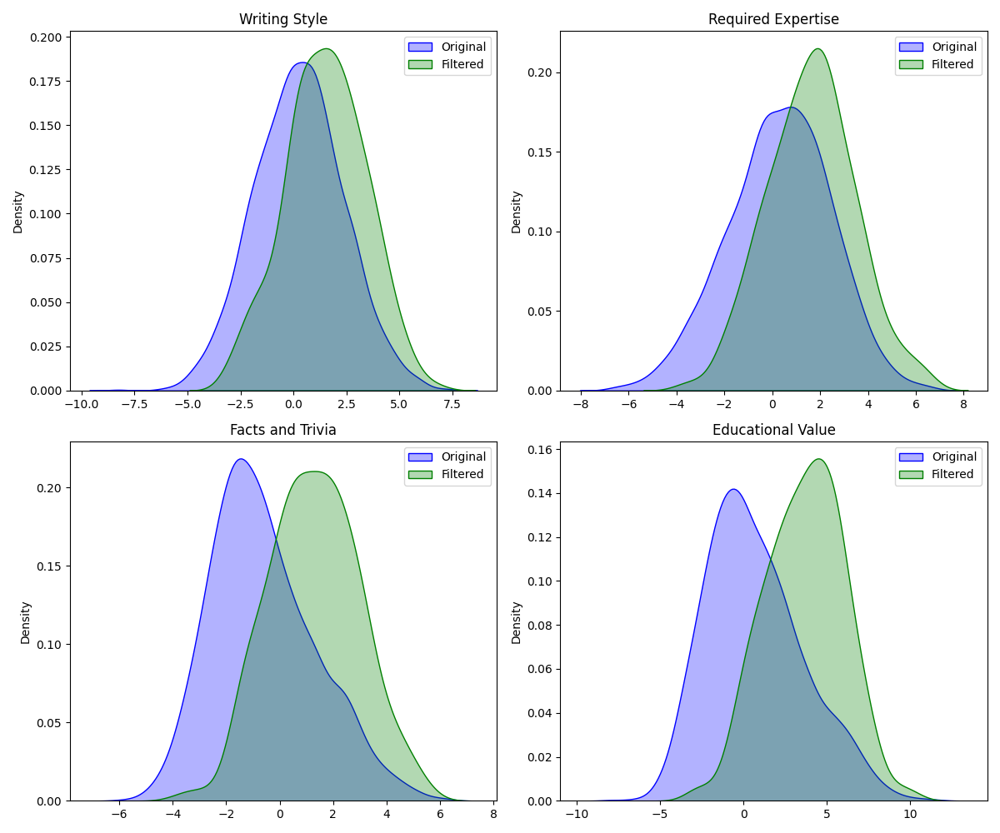
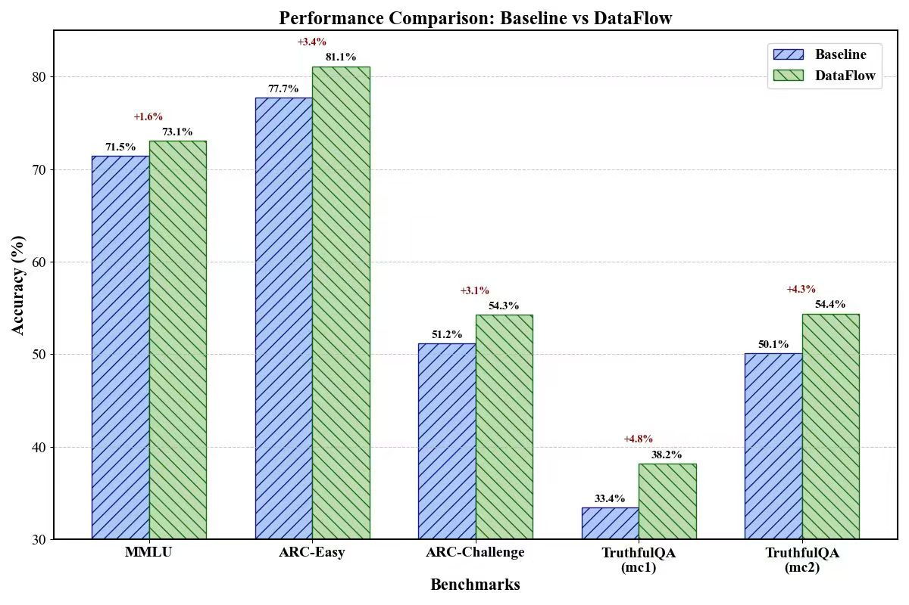
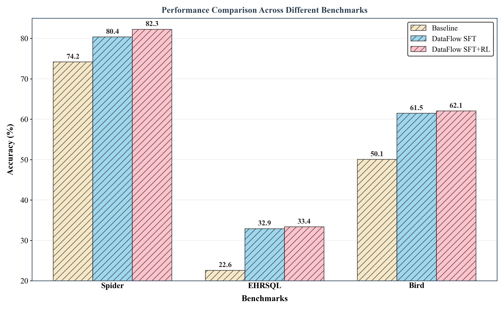

# DataFlow

<div align="center">
  

[](https://github.com/OpenDCAI/DataFlow/blob/main/LICENSE)
[](https://github.com/OpenDCAI/DataFlow)
[](https://github.com/OpenDCAI/DataFlow/issues)
[](https://github.com/OpenDCAI/DataFlow/commits/main/)
[](https://github.com/OpenDCAI/DataFlow/graphs/contributors)

简体中文 | [English](./README.md)

**[功能介绍](#功能介绍) • [快速开始](#快速开始) • [文档](https://OpenDCAI.github.io/DataFlow-Doc/) • [实验结果](#实验结果)**

</div>

https://github.com/user-attachments/assets/248359b6-fec1-4800-a2bc-f4a83cb5764b

## 1 最新动态

- [2025-06-28] 🎉 我们全新发布的以数据为中心的系统**DataFlow**已开源 —— 敬请关注后续更新！

## 2 项目概述


DataFlow 是一个数据准备系统，旨在从噪声数据源（PDF、纯文本、低质量问答）中**解析，生成，加工并评估高质量数据**，以提升大语言模型（LLMs）在特定领域的表现，支持预训练、监督微调（SFT）、强化学习训练以及基于知识库的 RAG 系统。**我们在医疗、金融和法律等多个垂类领域实证验证了 DataFlow 的有效性。**

我们构建了多种基于规则、深度学习、大语言模型及其 API 的 `数据算子（Operators）`，并将其系统性地整合为多条 `数据流水线（Pipelines）`，共同组成完整的 `DataFlow 系统`。此外，我们还构建了智能的 `DataFlow-Agent`，支持按需动态编排已有算子，合成新的数据流水线。

## 3 数据流程功能介绍

目前 DataFlow 包含以下主要数据处理流程：

- **文本处理流程（Text Pipeline）**：从大规模纯文本（多为网络爬取）中挖掘问答对，用于监督微调和强化学习训练。
  - 
  - [[HuggingFace🤗 示例数据]](https://huggingface.co/datasets/Open-Dataflow/dataflow-demo-Text)

- **推理流程（Reasoning Pipeline）**：增强已有问答对，添加 (1) 长链式推理（Chain-of-Thought），(2) 类别标注，(3) 难度估计。
  - 
  - [[HuggingFace🤗 示例数据]](https://huggingface.co/datasets/Open-Dataflow/dataflow-demo-Reasonning)

- **Text2SQL 流程**：将自然语言问题转化为 SQL 查询，辅以解释、思维链推理和数据库结构上下文信息。
  - 
  - [[HuggingFace🤗 示例数据]](https://huggingface.co/datasets/Open-Dataflow/dataflow-demo-Text2SQL)

- **Agent式RAG流程**：从已有问答或知识库中挖掘需要外部知识才能作答的问答对，用于训练 Agentic RAG 模型。

此外，我们还提供：

- **DataFlow-Agent**：基于任务需求，自动编排现有算子并合成新的数据处理流程。
  - [[HuggingFace🤗 示例数据]](https://huggingface.co/datasets/Open-Dataflow/dataflow-demo-Agent)

## 4 快速开始

请使用如下命令进行环境配置和安装👇

```bash
conda create -n dataflow python=3.10
conda activate dataflow

git clone https://github.com/OpenDCAI/DataFlow
cd DataFlow
pip install -e .
```
## 4 快速开始

更多使用说明和入门指南，请参考我们的 [项目文档](https://OpenDCAI.github.io/DataFlow-Doc/)。

## 5 实验结果

如需详细的实验设置，请参考文档或论文说明。

### 5.1 文本流程（Text Pipeline）

#### 5.1.1 预训练数据过滤流程

我们将 `预训练数据处理流程` 应用于从 RedPajama 数据集中随机采样的数据，最终保留率为 **13.65%**。使用 `QuratingScorer` 进行质量评估，结果如下图所示：在**写作风格、专业性要求、事实准确性和教育价值**四个维度上，过滤后的数据显著优于原始数据，验证了 DataFlow 预训练数据处理流程的有效性。



#### 5.1.2 微调（SFT）数据过滤流程

我们从 `alpaca` 数据集中筛选了 3000 条高质量数据，与随机选取的 3000 条 `alpaca` 数据进行对比，并在 Qwen2.5-7B 模型上进行 SFT 训练。对比结果如下：



### 5.2 推理流程（Reasoning Pipeline）

我们在 Qwen2.5-32B-Instruct 模型上，使用 Reasoning Pipeline 合成的 1000 条和 5000 条数据进行了微调训练（SFT），评估其对模型推理能力的提升，结果如下图所示：


### 5.3 Text2SQL 流程

我们在 Bird 数据集上使用 DataFlow-Text2SQL 流程构建数据，并分别通过监督微调（SFT）与强化学习（RL）对 Qwen2.5-Coder-7B 模型进行了训练。实验结果如下：




<!-- 
## 统计信息
<a href="https://star-history.com/#OpenDCAI/DataFlow&Date">
 <picture>
   <source media="(prefers-color-scheme: dark)" srcset="https://api.star-history.com/svg?repos=OpenDCAI/DataFlow&type=Date&theme=dark" />
   <source media="(prefers-color-scheme: light)" srcset="https://api.star-history.com/svg?repos=OpenDCAI/DataFlow&type=Date" />
   
 </picture>
</a> -->
