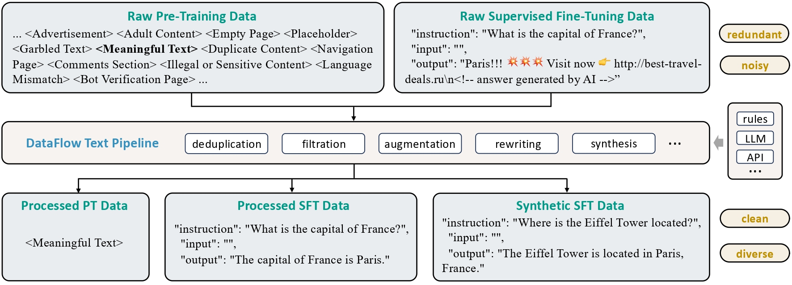
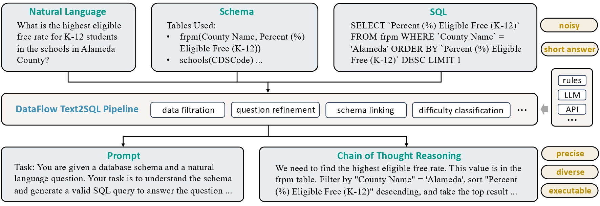
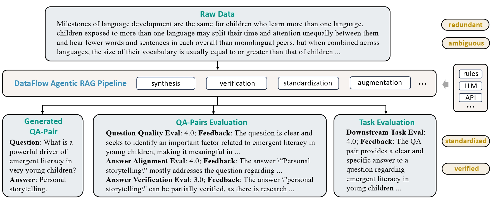

# DataFlow

<div align="center">
  


[](https://OpenDCAI.github.io/DataFlow-Doc/)
[](https://github.com/OpenDCAI/DataFlow/blob/main/LICENSE)
[](https://github.com/OpenDCAI/DataFlow)
[](https://github.com/OpenDCAI/DataFlow/issues)
[](https://github.com/OpenDCAI/DataFlow/graphs/contributors)
[](https://github.com/OpenDCAI/DataFlow)

<!-- [](https://github.com/OpenDCAI/DataFlow/commits/main/) -->

[简体中文](./README-zh.md) | English


**[Features](#Features) • [Quick Start](#Quick_Start) • [Documentation](https://OpenDCAI.github.io/DataFlow-Doc/) • [Experiments](#Experiments)**

</div>

https://github.com/user-attachments/assets/3dadeeb0-7007-4cdf-b412-593af000020c

## 1 News
🎉 [2025-06-28] We’re excited to announce that DataFlow, our Data-centric AI system, is now released! Stay tuned for future updates.

## 2 Overview

  

DataFlow is a data preparation and training system designed to **parse, generate, process and evaluate** high-quality data from noisy sources (PDF, plain-text, low-quality QA), thereby improving the performance of large language models (LLMs) in specific domains through targeted training (Pre-training, Supervised Fine-tuing, RL training) or RAG using knowledge base cleaning. **DataFlow has been empirically validated to improve domain-oriented LLM's performance in fields such as healthcare, finance, and law.**

Specifically, we constructing diverse `operators` leveraging rule-based methods, deep learning models, LLMs, and LLM APIs. These operators are systematically integrated into distinct `pipelines`, collectively forming the comprehensive `DataFlow system`. Additionally, we develop an intelligent `DataFlow-agent` capable of dynamically assembling new `pipelines` by recombining existing `operators` on demand.


<!-- Text: 输入是烂数据 通过大模型 输出QA （主要是强化学习）
NL2SQL: 反向构造SQL QA
Reasonning：Question很短，构建长链COT ，是否有category，是否有难度（通过大模型）
Agentic RAG: 输入QA，出来是 QA。没有额外信息解决不了，必须要引入
Knowlege Base Cleaning: PDF，表格+doc text输入，输出是高质量知识库
Dataflow-agent: 用Agent自动合成pipeline。编排已有算子。 -->

## 3 Pipelines Functionality
### 3.1 Ready-to-Use PipeLines
Current Pipelines in Dataflow are as follows:
- **Text Pipeline**: Mine question-answer pairs from large-scale plain-text data (mostly crawed from InterNet) for use in SFT and RL training.
  - 
  - [[HuggingFace🤗 demo input & output for **Text Pipeline**]](https://huggingface.co/datasets/Open-Dataflow/dataflow-demo-Text)
- **Reasoning Pipeline**: Enhances existing question–answer pairs with (1) extended chain-of-thought, (2) category classification, and (3) difficulty estimation.
  - 
  - [[HuggingFace🤗 demo input & output for **Reasoning Pipeline**]](https://huggingface.co/datasets/Open-Dataflow/dataflow-demo-Reasonning)
- **Text2SQL Pipeline**: Translates natural language questions into SQL queries, supplemented with explanations, chain-of-thought reasoning, and contextual schema information.
  - 
  - [[HuggingFace🤗 demo input & output for **Text2SQL Pipeline**]](https://huggingface.co/datasets/Open-Dataflow/dataflow-demo-Text2SQL)
- **Knowlege Base Cleaning Pipeline**: Extract and structure knowledge from unorganized sources like tables, PDFs, and Word documents into usable entries for downstream RAG or QA pair generation.
  - 
- **Agentic RAG Pipeline**: Identify and extract QA pairs from existing QA datasets or knowledge bases that require external knowledge to answer, for use in downstream training of Agnetic RAG tasks.
  - 
### 3.2 Flexible Operator PipeLines
In this framework, operators are categorized into Fundamental Operators, Generic Operators, Domain-Specific Operators, and Evaluation Operators, etc., supporting data processing and evaluation functionalities. Please refer to the [documentation](https://OpenDCAI.github.io/DataFlow-Doc/) for details.

### 3.3 Agent Guided Pipelines
<!-- Building on top of this, we also provide the -->
- **DataFlow Agent**: Can arrange existing `operators` and automatically construct new pipelines based on task requirements.
  - 
  - [[HuggingFace🤗 demo input & output for **DataFlow Agent**]](https://huggingface.co/datasets/Open-Dataflow/dataflow-demo-Agent)

<!-- ### 3.1 Text Pipeline
 -->

## 4 Quick Start
For environment setup and installation, please using the following commands👇

```shell
conda create -n dataflow python=3.10 
conda activate dataflow

pip install open-dataflow
```
If you want to use your own GPU to inference locally, please use:
```shell
pip install open-dataflow[vllm]
```
> Dataflow supports Python>=3.10

You can use follwing command to check if installed correctly:
```shell
dataflow -v
```

You are expected to see following outputs:
```log
open-dataflow codebase version: 1.0.0
        Checking for updates...
        Local version:  1.0.0
        PyPI newest version:  1.0.0
You are using the latest version: 1.0.0.
```

For **Quick-Start** and **Guide**, please visit our [Documentation](https://OpenDCAI.github.io/DataFlow-Doc/). 

[](https://OpenDCAI.github.io/DataFlow-Doc/)


## 5 Experimental Results
For Detailed Experiments setting, please visit our documentation.


### 5.1 Text PipeLine

#### 5.1.1 Pre-training data filter pipeline
The `pre-training data processing pipeline` was applied to randomly sampled data from the RedPajama dataset, resulting in a final data retention rate of 13.65%. The analysis results using `QuratingScorer` are shown in the figure. As can be seen, the filtered pretraining data significantly outperforms the original data across four scoring dimensions: writing style, requirement for expert knowledge, factual content, and educational value. This demonstrates the effectiveness of the DataFlow pretraining data processing.


#### 5.1.2 SFT data filter pipeline
We filted 3k record from `alpaca` dataset and compare it with radom selected 3k data from `alpaca` dataset by training it on Qwen2.5-7B. Results are:
<p align="center">
  
</p>

### 2. Reasoning Pipeline

We verify our reasoning pipeline by SFT on a Qwen2.5-32B-Instruct with Reasoning Pipeline synsthized data. We generated 1k and 5k SFT data pairs. Results are: 
<p align="center">
  
</p>


### 3. Text2SQL PipeLine
We fine-tuned the Qwen2.5-Coder-14B model on the Bird dataset using both Supervised Fine-tuning (SFT) and Reinforcement Learning (RL), with data constructed via the DataFlow-Text2SQL Pipeline. Results are:


<!-- ## Statistics
<a href="https://star-history.com/#OpenDCAI/DataFlow&Date">
 <picture>
   <source media="(prefers-color-scheme: dark)" srcset="https://api.star-history.com/svg?repos=OpenDCAI/DataFlow&type=Date&theme=dark" />
   <source media="(prefers-color-scheme: light)" srcset="https://api.star-history.com/svg?repos=OpenDCAI/DataFlow&type=Date" />
   
 </picture>
</a>
 -->
